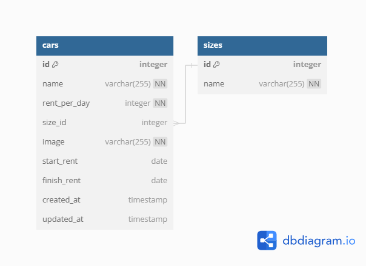

# Challenge 5 - RESTful API

Pada challenge di chapter ke-5 ini, kami diharuskan membuat sebuah RESTful API sederhana yang dapat digunakan untuk melakukan manajemen data mobil.

## Table of contents

- [Overview](#overview)
  - [The Challenge](#the-challenge)
  - [Quick Start](#quick-start)
  - [Entity Relationship Diagram](#entity-relationship-diagram)
  - [Endpoints](#endpoints)
- [Example](#example)
  - [Cars](#cars)
  - [Sizes](#sizes)
- [My process](#my-process)
  - [Built with](#built-with)
  - [What I learned](#what-i-learned)
  - [Useful resources](#useful-resources)
- [Author](#author)

## Overview

### The Challenge

1. Membuat HTTP Server yang dapat digunakan untuk melakukan manajemen data mobil
2. Membuat Entity Relationship Diagram dengan menggunakan dbdiagram.io

### Quick Start

- Clone repo: `git clone -b Challenge_5 --single-branch https://github.com/zulfikarpinem/F-FSW24001119-synrgy7-zul-bcr.git`
- Pindah ke direktori yang baru di clone
- Jalankan `pnpm install`
- Copy file `.env.example` menjadi `.env`, dan sesuaikan _variable_-nya
- Untuk menjalankan _migration_, lakukan `pnpm run db:migrate`
- Untuk menjalankan _seeder_, lakukan `pnpm run db:seed`
- Jalankan server menggunakan `pnpm run dev`
- That's it.

### Entity Relationship Diagram



### Endpoints

| Endpoint           | Method | Description                         |
| ------------------ | ------ | ----------------------------------- |
| `/api/v1/cars`     | GET    | Mengambil semua data mobil          |
| `/api/v1/cars/:id` | GET    | Mengambil data mobil berdasarkan ID |
| `/api/v1/cars`     | POST   | Menyimpan data mobil baru           |
| `/api/v1/cars/:id` | PUT    | Mengedit data mobil berdasarkan ID  |
| `/api/v1/cars/:id` | DELETE | Menghapus data mobil berdasarkan ID |

## Example

### Cars

- **Get All Cars**

  - **Request**

    Endpoint : `/api/v1/cars`

    Method : `GET`

  - **Response**

    ```json
    {
      "message": "Successfully get all cars",
      "count": 4,
      "data": [
        {
          "id": 1,
          "name": "Toyota Avanza",
          "rent_per_day": 200000,
          "size": {
            "id": 2,
            "name": "Medium"
          },
          "image": "/public/uploads/images/avanza.jpg",
          "start_rent": null,
          "finish_rent": null,
          "created_at": "2024-05-13T04:31:11.490Z",
          "updated_at": "2024-05-13T04:31:11.490Z"
        },
        ...,
        {
          "id": 4,
          "name": "Toyota Fortuner",
          "rent_per_day": 500000,
          "size": {
            "id": 3,
            "name": "Large"
          },
          "image": "/public/uploads/images/fortuner.jpg",
          "start_rent": null,
          "finish_rent": null,
          "created_at": "2024-05-13T04:31:11.490Z",
          "updated_at": "2024-05-13T04:31:11.490Z"
        }
      ]
    }
    ```

- **Get Car by ID**

  - **Request**

    Endpoint : `/api/v1/cars/1`

    Method : `GET`

  - **Response**

    ```json
    {
      "message": "Successfully get a car",
      "data": {
        "id": 1,
        "name": "Toyota Avanza",
        "rent_per_day": 200000,
        "size": {
          "id": 2,
          "name": "Medium"
        },
        "image": "/public/uploads/images/avanza.jpg",
        "start_rent": null,
        "finish_rent": null,
        "created_at": "2024-05-13T04:31:11.490Z",
        "updated_at": "2024-05-13T04:31:11.490Z"
      }
    }
    ```

- **Store Car**

  - **Request**

    Endpoint : `/api/v1/cars`

    Method : `POST`

    Body :

    | Field        | Value        |
    | ------------ | ------------ |
    | name         | BMW M4       |
    | rent_per_day | 2000000      |
    | size_id      | 2            |
    | image        | file: m4.jpg |

  - Response

    ```json
    {
      "message": "Successfully create a car",
      "data": {
        "id": 5,
        "name": "BMW M4",
        "rent_per_day": 2000000,
        "size": {
          "id": 2,
          "name": "Medium"
        },
        "image": "/public/uploads/images/image-1715575546965-87818758.png",
        "start_rent": null,
        "finish_rent": null,
        "created_at": "2024-05-13T04:45:46.992Z",
        "updated_at": "2024-05-13T04:45:46.992Z"
      }
    }
    ```

- **Update Car**

  - **Request**

    Endpoint : `/api/v1/cars/5`

    Method : `PUT`

    Body :

    | Field       | Value             |
    | ----------- | ----------------- |
    | size_id     | 3                 |
    | image       | file: m4-baru.jpg |
    | start_rent  | 2024-05-12        |
    | finish_rent | 2024-05-14        |

  - Response

    ```json
    {
      "message": "Successfully update a car",
      "data": {
        "id": 5,
        "name": "BMW M4",
        "rent_per_day": 2000000,
        "size": {
          "id": 3,
          "name": "Large"
        },
        "image": "/public/uploads/images/image-1715575564649-937713166.jpg",
        "start_rent": "2024-05-12T17:00:00.000Z",
        "finish_rent": "2024-05-14T17:00:00.000Z",
        "created_at": "2024-05-13T04:45:46.992Z",
        "updated_at": "2024-05-13T04:46:04.665Z"
      }
    }
    ```

- **Delete Car**

  - **Request**

    Endpoint : `/api/v1/cars/5`

    Method : `DELETE`

  - Response

    ```json
    {
      "message": "Successfully delete a car"
    }
    ```

### Size

- **Get All Sizes**

  - **Request**

    Endpoint : `/api/v1/sizes`

    Method : `GET`

  - **Response**

    ```json
    {
      "message": "Successfully get all sizes",
      "count": 3,
      "data": [
        {
          "id": 1,
          "name": "Small",
          "created_at": "2024-05-13T04:31:06.324Z",
          "updated_at": "2024-05-13T04:31:06.324Z"
        },
        {
          "id": 2,
          "name": "Medium",
          "created_at": "2024-05-13T04:31:06.324Z",
          "updated_at": "2024-05-13T04:31:06.324Z"
        },
        {
          "id": 3,
          "name": "Large",
          "created_at": "2024-05-13T04:31:06.324Z",
          "updated_at": "2024-05-13T04:31:06.324Z"
        }
      ]
    }
    ```

- **Get Size by ID**

  - **Request**

    Endpoint : `/api/v1/sizes/2`

    Method : `GET`

  - **Response**

    ```json
    {
      "message": "Successfully get a size",
      "data": {
        "id": 2,
        "name": "Medium",
        "created_at": "2024-05-13T04:31:06.324Z",
        "updated_at": "2024-05-13T04:31:06.324Z"
      }
    }
    ```

- **Store Size**

  - **Request**

    Endpoint : `/api/v1/sizes`

    Method : `POST`

    Body :

    | Field | Value       |
    | ----- | ----------- |
    | name  | Extra Large |

  - Response

    ```json
    {
      "message": "Successfully create a size",
      "data": {
        "id": 4,
        "name": "Extra Large",
        "created_at": "2024-05-13T04:46:22.534Z",
        "updated_at": "2024-05-13T04:46:22.534Z"
      }
    }
    ```

- **Update Size**

  - **Request**

    Endpoint : `/api/v1/sizes/4`

    Method : `PUT`

    Body :

    | Field | Value       |
    | ----- | ----------- |
    | name  | Super Large |

  - Response

    ```json
    {
      "message": "Successfully update a size",
      "data": {
        "id": 4,
        "name": "Super Large",
        "created_at": "2024-05-13T04:46:22.534Z",
        "updated_at": "2024-05-13T04:46:28.191Z"
      }
    }
    ```

- **Delete Size**

  - **Request**

    Endpoint : `/api/v1/sizes/4`

    Method : `DELETE`

  - Response

    ```json
    {
      "message": "Successfully delete a size"
    }
    ```

## My process

### Built with

- TypeScript
- Node.js
- PostgreSQL
- [Express.js](https://expressjs.com/) - Minimalist Web Framework for Node.js
- [Knex.js](https://knexjs.org/) - SQL Query Builder for JavaScript

### What I learned

1. Express.js
2. Express.js with TypeScript
3. Restful API
4. Database
5. Database: PostgreSQL

### Useful resources

- [Knex.js Update Trigger in PostgreSQL](https://stackoverflow.com/questions/36728899/knex-js-auto-update-trigger) - Jawaban dari pertanyaan StackOverflow ini membantu saya dalam membuat agar isi kolom `updated_at` di dalam tabel dapat berubah sesuai dengan kapan data mendapatkan perubahan.

## Author

- Mhd Zulfikar Pinem - [zulfikarm022@gmail.com](mailto:zulfikarm022@gmail.com)
